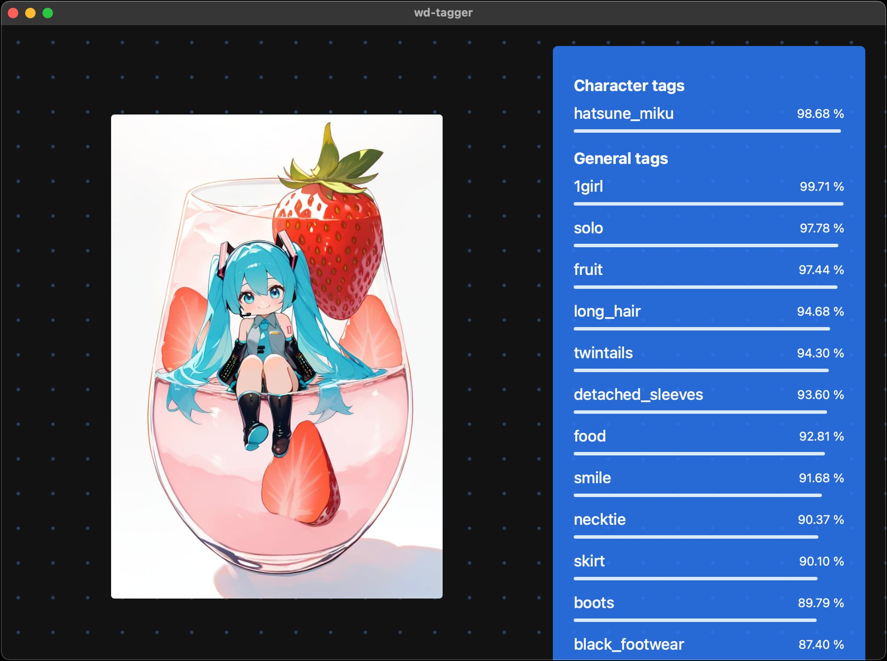

# wd-tagger.app

Run [Waifu Diffusion tagger](https://huggingface.co/spaces/SmilingWolf/wd-tagger) as a desktop GUI app, no Python required.

> [!NOTE]
> WIP

## Tech Stack

- Backend
  - [Tauri v2](https://v2.tauri.app/)
  - [Tauri Specta](https://github.com/specta-rs/tauri-specta/tree/feat/tauri-v2-stable)
  - [wd-tagger-rs](https://github.com/p1atdev/wd-tagger-rs)
- Frontend
  - [Svelte/SvelteKit](https://svelte.jp/)
  - [TailwindCSS](https://tailscale.com/)

## Screenshot

